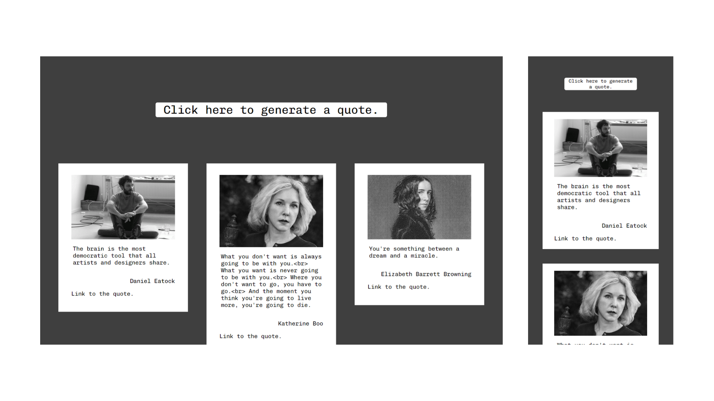

# random-quote-using-async-await

In this repository, I experimented with forms in Javascript through several exercises.

---

Project completed

In this project, I created a site that generates random quotes when you click on a dedicated button. This project is an exercise realized during the training web developer junior given by Becode.org

---

## Language

- HTML
- SCSS
- JS

---

## How to install the repository locally

1. create a local working folder
2. open Git Bash
3. clone the repository
4. now you can work on the file

---

[Link to my Github page.](https://mathildecornelis.github.io/random-quote-using-async-await/)
